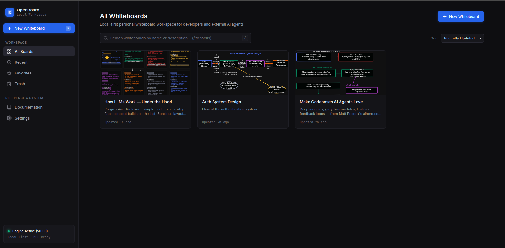

<div align="center">

# ✦ OpenBoard

**Local-first personal whiteboard workspace for developers and external AI agents.**

[](https://www.npmjs.com/package/openboard-app)
[](https://www.npmjs.com/package/openboard-app)
[](LICENSE)
[](https://github.com/atpaawej/openboard/actions)
[](https://modelcontextprotocol.io/)
[](package.json)

<br />



<br />

```bash
# Launch directly without installing:
npx openboard-app start

# Or install globally:
npm install -g openboard-app
openboard start
```

<br />

All whiteboards, documents, and canvas metadata reside locally in your SQLite database:  
`~/.openboard/openboard.db`

</div>

---

## ✦ Table of Contents

- [Overview](#-overview)
- [Key Features](#-key-features)
- [Quick Start](#-quick-start)
- [Model Context Protocol (MCP) Integration](#-model-context-protocol-mcp-integration)
- [AI Agent Quick Setup](#-ai-agent-quick-setup)
- [13 Semantic MCP Tools](#-13-semantic-mcp-tools)
- [Architecture & Guarantees](#-architecture--guarantees)
- [Monorepo Structure](#-monorepo-structure)
- [Keyboard Shortcuts](#-keyboard-shortcuts)
- [CLI Reference](#-cli-reference)
- [Contributing & Community](#-contributing--community)
- [License](#-license)

---

## ✦ Overview

**OpenBoard** is a modern, lightweight, local-first infinite whiteboard pairing an interactive **tldraw** canvas with a high-performance **Model Context Protocol (MCP)** server.

It is designed for developers who want a fast personal whiteboard and for autonomous AI coding agents (**Claude Code**, **Cursor**, **OpenCode**, **OpenAI Codex**, **OpenClaw**, **Hermes**) to inspect, create, organize, and update software architecture diagrams, system topologies, database schemas, and workflows collaboratively.

```text
  ┌───────────────────────────────────────────────────────────┐
  │                     EXTERNAL AI AGENT                     │
  │     (Claude Code, Cursor, OpenCode, Codex, Hermes...)     │
  └─────────────────────────────┬─────────────────────────────┘
                                │ JSON-RPC 2.0 (stdio / SSE)
                                ▼
  ┌───────────────────────────────────────────────────────────┐
  │                   OPENBOARD MCP SERVER                    │
  │               (13 High-Level Semantic Tools)              │
  └──────────────┬─────────────────────────────┬──────────────┘
                 │                             │
                 ▼                             ▼
  ┌───────────────────────────┐ ┌─────────────────────────────┐
  │   LOCAL SQLITE DATABASE   │ │   HEADLESS CANVAS ENGINE    │
  │ (~/.openboard/openboard.db│ │  (tldraw store + SVG vector)│
  └───────────────────────────┘ └──────────────┬──────────────┘
                                               │
                                               ▼ SSE Live Sync
                                ┌─────────────────────────────┐
                                │     BROWSER WHITEBOARD      │
                                │   (http://localhost:4747)   │
                                └─────────────────────────────┘
```

---

## ✦ Key Features

- 🔒 **Local-First & 100% Private:** Zero cloud dependencies, zero telemetry, zero accounts. Everything lives in your local SQLite database (`~/.openboard/openboard.db`).
- 🤖 **AI Agent Native:** Built-in stdio & SSE Model Context Protocol server exposing 13 semantic tools for creating and mutating canvas elements.
- 🎨 **Twenty-Inspired Dark Workspace:** Elegant near-black surfaces (`#0e0e11`), electric blue accents (`#2563eb`), zero-dependency SVG iconography, and responsive design.
- 👁️ **Headless Canvas Inspection & SVG Screenshots:** Agents inspect semantic canvas hierarchies and render pixel-perfect vector SVG snapshots without needing a browser window.
- ⚡ **Live Browser Projection (SSE):** If a user is viewing a board in their browser, agent modifications stream seamlessly into the viewport in real time.
- ⌨️ **Keyboard-First Productivity:** Press `N` for new whiteboards, `/` to focus search, `Esc` to dismiss dialogs, and `Enter` to confirm.
- 🗃️ **Complete Board Lifecycle:** Multi-board dashboard, favorites, instant duplication, debounced autosave, soft delete (Trash), and permanent purging.

---

## ✦ Quick Start

### Option 1: Run with `npx` (No installation required)

```bash
npx openboard-app start
```

### Option 2: Install globally via `npm`

```bash
npm install -g openboard-app
openboard start
```

### Option 3: Connect to your AI Agent immediately

```bash
openboard mcp
```

---

## ✦ Model Context Protocol (MCP) Integration

OpenBoard provides a universal Model Context Protocol server over `stdio` (and HTTP/SSE at `http://localhost:4747/api/mcp`).

### Universal MCP JSON Configuration

Add this to your MCP configuration file:

```json
{
  "mcpServers": {
    "openboard": {
      "command": "openboard",
      "args": ["mcp"]
    }
  }
}
```

---

## ✦ AI Agent Quick Setup

| AI Client | Setup Path or Command | Format |
| :--- | :--- | :--- |
| **Claude Code** | `claude mcp add openboard --command="openboard" --args="mcp"` | CLI / `~/.claude.json` |
| **Cursor** | `~/.cursor/mcp.json` | JSON (`mcpServers`) |
| **OpenCode** | `~/.config/opencode/opencode.jsonc` | JSONC (`mcp.openboard`) |
| **OpenAI Codex** | `~/.codex/config.toml` | TOML (`mcp_servers.openboard`) |
| **OpenClaw** | `~/.openclaw/config.json` | JSON (`mcpServers`) |
| **Hermes Agent** | `~/.hermes/config.yaml` | YAML (`mcp_servers`) |
| **Generic MCP** | Any client supporting stdio MCP JSON-RPC 2.0 | `openboard mcp` |

---

## ✦ 13 Semantic MCP Tools

OpenBoard equips AI agents with 13 semantic tools structured for developer tasks:

### Board Organization & Management
1. `list_boards`: Search and filter whiteboards (`all`, `recent`, `favorites`, `trash`).
2. `create_board`: Create a new whiteboard with title and optional description.
3. `get_board`: Retrieve board metadata, document summary, and timestamps.
4. `rename_board`: Rename an existing whiteboard.
5. `duplicate_board`: Clone a board and its complete canvas document.
6. `favorite_board`: Bookmark or toggle favorite status.
7. `delete_board`: Move a whiteboard to Trash (soft delete).
8. `restore_board`: Recover a deleted whiteboard from Trash.

### Canvas Inspection & Manipulation
9. `get_canvas_state`: Retrieve structured shapes, bounds, text, and arrow bindings.
10. `get_canvas_screenshot`: Render a headless vector SVG visual screenshot.
11. `create_shapes`: Create shapes (rectangles, ellipses, notes, text, frames, arrows).
12. `update_shapes`: Modify positions, dimensions, text, colors, or arrow bindings.
13. `delete_shapes`: Remove shapes and automatically clean up associated connections.

---

## ✦ Architecture & Guarantees

1. **MCP does not connect directly to SQLite:** All operations flow through domain-validated `BoardService` and `CanvasService`.
2. **MCP does not connect directly to React:** Canvas operations execute against a headless tldraw store engine.
3. **Browser Optional for AI Agents:** Agents can create, query, and modify boards whether the web UI is open or closed.
4. **Explicit `board_id` targeting:** Every canvas operation explicitly references the target board ID.
5. **Live Projection:** If a user opens the board in a browser, changes made by external agents project into the active view instantly via SSE.

---

## ✦ Monorepo Structure

```text
openboard/
├── apps/
│   ├── web/               # React 18 + Vite frontend (tldraw canvas, Twenty dark UI, Docs)
│   └── server/            # Express + SQLite API server + SSE live projection
├── packages/
│   ├── shared/            # TypeScript interfaces, DTOs, schemas & shape contracts
│   ├── storage/           # SQLiteBoardRepository with ACID migrations & memory fallback
│   ├── core/              # BoardService, CanvasService, HeadlessSvgRenderer
│   └── mcp/               # OpenBoardMcpServer (stdio / SSE JSON-RPC 2.0 transport)
├── cli/                   # openboard-app CLI binary with embedded web assets
├── docs/                  # Architectural guides & AI agent integration tutorials
└── .github/               # CI workflows and issue / PR templates
```

---

## ✦ Keyboard Shortcuts

| Shortcut | Action |
| :--- | :--- |
| <kbd>N</kbd> | Open New Whiteboard modal |
| <kbd>/</kbd> | Focus dashboard search bar |
| <kbd>Esc</kbd> | Clear search input / Dismiss modal or context menu |
| <kbd>Enter</kbd> | Submit modal form / Open selected board |

---

## ✦ CLI Reference

```bash
openboard start      # Start local workspace server & open web dashboard (default port: 4747)
openboard mcp        # Start Model Context Protocol server on stdio for AI agents
openboard info       # Display local configuration, database path, and agent MCP details
openboard -v         # Display installed version
openboard --help     # Display CLI help
```

### Options for `openboard start`

- `-p, --port <number>`: Port to listen on (default: `4747`)
- `-h, --host <host>`: Host address to bind to (default: `localhost`)
- `--db <path>`: Custom SQLite database path (default: `~/.openboard/openboard.db`)
- `--no-open`: Do not automatically open browser on startup

---

## ✦ Contributing & Community

Contributions are warmly welcome! Whether you are reporting an issue, proposing an MCP feature, or improving developer documentation:

1. Read our [Contributing Guidelines](CONTRIBUTING.md).
2. Check our [Code of Conduct](CODE_OF_CONDUCT.md).
3. Report security disclosures privately per our [Security Policy](SECURITY.md).

```bash
# Clone the repository
git clone https://github.com/atpaawej/openboard.git
cd openboard

# Install dependencies & build
npm install
npm run typecheck
npm run test
npm run build
```

---

## ✦ License

OpenBoard is open-source software licensed under the [MIT License](LICENSE).  
Copyright © 2026 OpenBoard Contributors.
